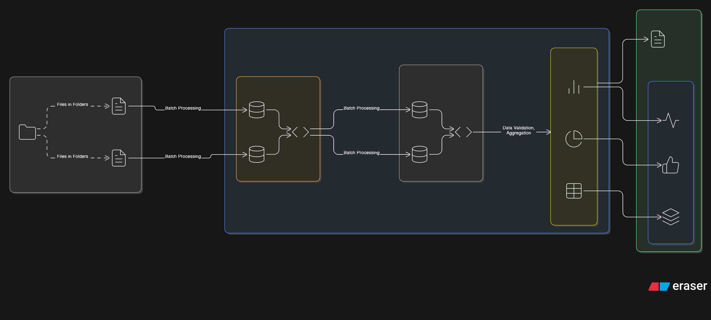
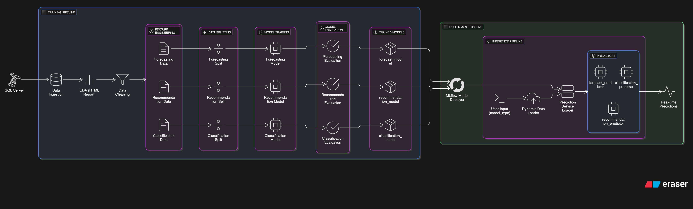
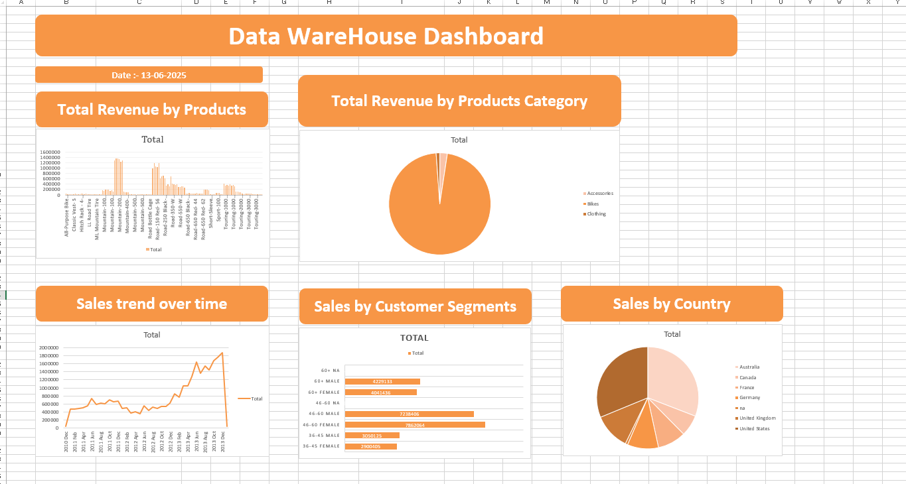

# 🧠 End-to-End Data Science Project with ZenML, MLflow & FastAPI

This project demonstrates a complete end-to-end Data Science lifecycle starting from raw data ingestion to ML model deployment using **ZenML**, **MLflow**, **Docker**, and **FastAPI**. It follows best practices in data engineering and ML pipeline design.

---

## 📌 Project Overview

### 🔍 Objective

To build a scalable, reproducible, and production-ready ML pipeline using structured Data Warehousing (Bronze, Silver, Gold layers), automated pipelines for training and deployment, and containerized deployment via FastAPI.

---

## 🔁 Project Flow

### Step-by-Step Breakdown:

1. **📅 Data Ingestion**

   * Raw CSV data is collected and stored in the `datasets/` directory.

2. **🏗️ Data Warehousing (Bronze, Silver, Gold)**

   * **Bronze**: Raw data
   * **Silver**: Cleaned and transformed
   * **Gold**: Aggregated and analysis-ready

3. **📊 Excel Reporting**

   * Business-friendly Excel reports created from Gold layer data.

4. **🔁 ML Pipeline (ZenML)**

   * Modular pipeline stages:

     * Data Ingestion
     * EDA (auto-generated HTML report)
     * Data Cleaning
     * Feature Engineering
     * Model Training
     * Model Evaluation

5. **📈 Experiment Tracking (MLflow)**

   * Track metrics, parameters, and models using MLflow.

6. **🚀 Deployment**

   * ❌ ZenML/MLflow Server (not supported on Windows)
   * ✅ Docker + FastAPI based deployment

---

## 📁 Folder Structure

```
.
├── Data_warehouse/           # Bronze, Silver, and Gold layered data
├── datasets/                 # Source CSV files
├── Excel report/             # Excel report for final business analysis
├── input_samples/            # Example inputs for inference
├── pipelines/                # ZenML pipelines
├── reports/                  # EDA reports
├── src/                      # Source code for data handling & modeling
├── steps/                    # Modular steps for each pipeline stage
├── test/                     # Unit tests
├── wrapper/                  # ZenML wrapper configs
├── main.py                   # FastAPI application entry point
├── run_training_pipeline.py  # Run training pipeline
├── run_deployment_pipeline.py# Run deployment pipeline
├── requirements.txt          # Python dependencies
├── Dockerfile                # Docker container config
├── docker-compose.yml        # Compose file (if needed)
└── README.md                 # Project documentation
```

---

## 🧲 ZenML Pipeline Overview

```bash
# Run training pipeline
python run_training_pipeline.py

# Run deployment pipeline
python run_deployment_pipeline.py
```

---

## 🐳 Docker + FastAPI Deployment

### ⚖️ Build & Run

```bash
# Build Docker image
docker build -t end-to-end-ml-app .

# Run container
docker run -p 8000:8000 end-to-end-ml-app
```

📍 **API Access**: [http://localhost:8000/docs](http://localhost:8000/docs)

---

## 🖼️ Project Images

### ⚖️ Data Warehouse Architecutre



### 💡 Pipeline Architecture



### 📊 Excel Report Sample




---

## 🧰 Tech Stack

| Layer                  | Tool/Tech                       |
| ---------------------- | ------------------------------- |
| Data Ingestion         | CSV, Pandas                     |
| Data Warehouse         | Bronze / Silver / Gold (manual) |
| Pipeline Orchestration | ZenML                           |
| Experiment Tracking    | MLflow                          |
| Model Training         | Scikit-learn / XGBoost          |
| Reporting              | Excel + ydata-profiling         |
| Deployment             | FastAPI + Docker                |

---

## 📬 Contact

> Created by **Chitrang Potdar**
> 📧 potdarchitrang4@gmail.com

---
